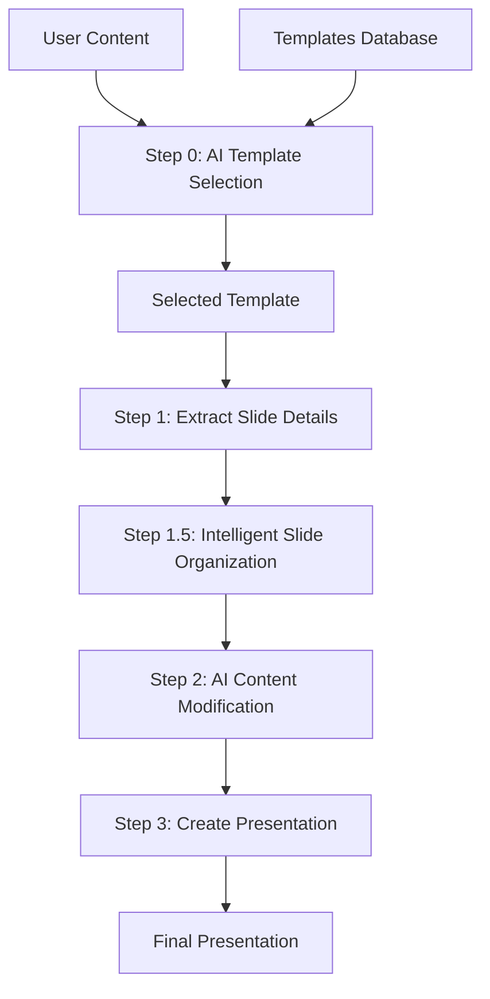

# Dynamic Template Selection Feature Guide

## 🎯 Overview

The Dynamic Template Selection feature enhances JuniorAI by enabling intelligent selection of PowerPoint templates from a curated database of Microsoft Create templates. Using Google's Gemini AI, the system analyzes user content and automatically selects the most suitable template for the presentation.

## 🚀 Key Features

### ✅ **Intelligent Template Matching**
- AI-powered analysis of user content and requirements
- Automatic template selection based on content theme, complexity, and purpose
- Confidence scoring and detailed reasoning for template choices

### ✅ **Comprehensive Template Database**
- Automated scraping of 100+ PowerPoint templates from Microsoft Create
- Rich metadata extraction including features, themes, and use cases
- Structured JSON database for efficient AI analysis

### ✅ **Seamless Workflow Integration**
- Zero-disruption integration with existing JuniorAI workflow
- Fallback to default template if selection fails
- Enhanced workflow with template selection as Step 0

## 📋 Prerequisites

### Additional Dependencies
```bash
pip install selenium beautifulsoup4 requests
```

### Chrome WebDriver
- Download ChromeDriver from [https://chromedriver.chromium.org/](https://chromedriver.chromium.org/)
- Ensure ChromeDriver is in your system PATH
- Alternative: Use webdriver-manager for automatic driver management

## 🔧 Setup Instructions

### 1. **Install Dependencies**
```bash
cd juniorAI
pip install -r requirements.txt
```

### 2. **Scrape Templates Database**
```bash
cd scripts
python template_scraper.py
```
This will create `./content/microsoft_templates.json` with all available templates.

### 3. **Run Enhanced Workflow**
```bash
python main.py
```
The workflow now includes automatic template selection as Step 0.

## 📊 Template Database Structure

### **Template Information Schema**
```json
{
  "id": "ms_template_001",
  "title": "Modern Business Presentation",
  "description": "Professional template for business presentations...",
  "category": "Business",
  "theme": "Modern",
  "estimated_slides": 12,
  "features": ["Charts", "Infographics", "Timeline"],
  "preview_url": "https://...",
  "download_url": "https://...",
  "tags": ["professional", "corporate", "modern"],
  "color_scheme": "Professional Blue",
  "layout_types": ["Title Slide", "Content Slide", "Chart Slide"],
  "difficulty_level": "Intermediate",
  "use_cases": ["Business Presentation", "Meeting"]
}
```

### **Database Metadata**
```json
{
  "metadata": {
    "total_templates": 150,
    "source": "Microsoft Create PowerPoint Templates",
    "scraped_at": "2024-01-15 10:30:00",
    "url": "https://create.microsoft.com/en-us/search?filters=powerpoint"
  },
  "templates": [...]
}
```

## 🤖 AI Template Selection Process

### **Step 1: Content Analysis**
- Gemini AI analyzes user content for theme, purpose, and complexity
- Identifies required features (charts, timelines, etc.)
- Determines target audience and presentation style

### **Step 2: Template Matching**
- Compares content requirements with template capabilities
- Scores templates based on multiple criteria:
  - Content alignment (0.0-1.0)
  - Design appropriateness (0.0-1.0)
  - Feature match (0.0-1.0)
  - Complexity fit (0.0-1.0)
  - Use case match (0.0-1.0)

### **Step 3: Selection & Reasoning**
- Selects highest-scoring template
- Provides detailed reasoning for the choice
- Generates confidence score and matching criteria

## 📁 File Structure Updates

```
scripts/
├── template_scraper.py              # NEW: Template scraping utility
├── intelligent_template_selector.py # NEW: AI-powered template selection
├── main.py                         # UPDATED: Enhanced workflow
├── content/
│   ├── microsoft_templates.json    # NEW: Scraped templates database
│   └── selected_template.json      # NEW: AI selection results
└── requirements.txt                # UPDATED: New dependencies
```

## 🔄 Enhanced Workflow



### **Workflow Steps**
1. **Step 0**: 🆕 AI Template Selection
2. **Step 1**: Extract slide details from selected template
3. **Step 1.5**: Intelligent slide organization
4. **Step 2**: AI content modification
5. **Step 3**: Create final presentation

## 🎛️ Configuration Options

### **Template Scraper Settings**
```python
# In template_scraper.py
scraper = MicrosoftTemplatesScraper(
    headless=True,  # Run browser in headless mode
)
```

### **Template Selector Settings**
```python
# In intelligent_template_selector.py
selector = IntelligentTemplateSelector(
    api_key=GOOGLE_API_KEY,
    model_name="gemini-2.5-flash-preview-05-20"
)
```

### **Main Workflow Settings**
```python
# In main.py
TEMPLATES_DATABASE_JSON = "./content/microsoft_templates.json"
SELECTED_TEMPLATE_JSON = "./content/selected_template.json"
```

## 📊 Usage Examples

### **Example 1: Business Presentation**
```python
user_content = """
I need to create a quarterly business review presentation for our executive team.
The presentation should include financial performance, market analysis, 
competitive landscape, and strategic initiatives for next quarter.
"""

# AI will likely select a professional business template with:
# - Chart layouts for financial data
# - Professional color scheme
# - Executive-appropriate design
# - Multiple content layouts
```

### **Example 2: Educational Content**
```python
user_content = """
Creating a training presentation about cybersecurity best practices 
for our employees. Need to cover password security, phishing awareness,
and data protection protocols.
"""

# AI will likely select an educational template with:
# - Clear, readable layouts
# - Infographic capabilities
# - Step-by-step presentation flow
# - Training-focused design
```

## 🔍 Template Selection API

### **Single Template Selection**
```python
from intelligent_template_selector import IntelligentTemplateSelector

selector = IntelligentTemplateSelector(api_key, model_name)
selector.load_templates_database("./content/microsoft_templates.json")

recommendation = selector.select_best_template(
    user_content="Your presentation content...",
    user_requirements="Additional requirements..."  # Optional
)

print(f"Selected: {recommendation.template_title}")
print(f"Confidence: {recommendation.confidence_score}")
print(f"Reasoning: {recommendation.reasoning}")
```

### **Multiple Recommendations**
```python
recommendations = selector.get_top_recommendations(
    user_content="Your content...",
    top_n=3
)

for i, rec in enumerate(recommendations, 1):
    print(f"{i}. {rec.template_title} ({rec.confidence_score:.2f})")
```

## 🚨 Troubleshooting

### **Common Issues**

#### **1. ChromeDriver Not Found**
```bash
# Install webdriver-manager for automatic driver management
pip install webdriver-manager

# Or download ChromeDriver manually and add to PATH
```

#### **2. Templates Database Missing**
```bash
# Run the scraper to create the database
python template_scraper.py
```

#### **3. Template Selection Fails**
- The workflow automatically falls back to the default template
- Check API key and internet connection
- Verify templates database exists and is valid

#### **4. Scraping Fails**
- Microsoft Create site structure may have changed
- Update CSS selectors in `template_scraper.py`
- Check for rate limiting or access restrictions

### **Debug Mode**
```python
# Enable debug mode for detailed logging
scraper = MicrosoftTemplatesScraper(headless=False)  # Show browser
selector = IntelligentTemplateSelector(api_key, model_name)
# Check console output for detailed error messages
```

## 🔮 Future Enhancements

### **Planned Features**
1. **Template Download Integration**
   - Automatic download of selected templates
   - Local template cache management
   - Template file validation

2. **Custom Template Support**
   - User-uploaded template analysis
   - Custom template database creation
   - Template quality scoring

3. **Advanced Filtering**
   - Industry-specific template filtering
   - Color scheme preferences
   - Slide count requirements

4. **Template Preview**
   - Visual template previews in selection
   - Side-by-side template comparison
   - Interactive template browser

## 📞 Support

For issues related to the template selection feature:

1. **Check the console output** for detailed error messages
2. **Verify all dependencies** are installed correctly
3. **Ensure ChromeDriver** is properly configured
4. **Check API quotas** for Google Gemini AI
5. **Review template database** for corruption or missing data

## 🎉 Benefits

### **For Users**
- ✅ Automatic template selection saves time
- ✅ AI ensures optimal template-content matching
- ✅ Access to 100+ professional templates
- ✅ Consistent, high-quality presentation design

### **For Developers**
- ✅ Modular, extensible architecture
- ✅ Comprehensive error handling and fallbacks
- ✅ Rich metadata for future enhancements
- ✅ Clean integration with existing workflow

---

**🚀 Ready to create amazing presentations with AI-powered template selection!** 